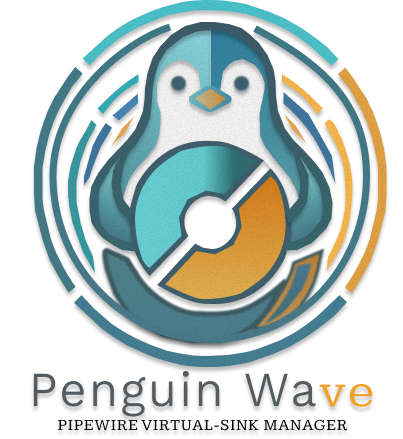
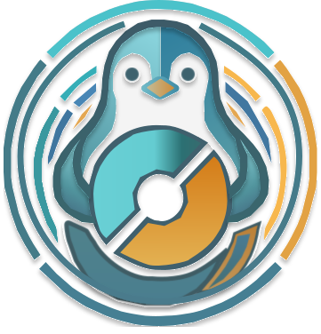

<div align="center">



**PipeWire virtual-sink manager and headset ChatMix control for Linux gamers.**

Route per-app audio between virtual sinks and drive your headset's ChatMix wheel from one place — a Linux-native take on what SteelSeries Sonar does on Windows.


</div>

---

## This tree

Working tree for Penguin Wave 0.3.0 daemon/UI split. Lands back in main repo at P6.

Design: `PenguinWave/claudedocs/{REQUIREMENTS,DESIGN}-daemon-split.md`
Plan: `PenguinWave/claudedocs/workflow_daemon_split.md`

## What it does

- **Virtual sinks** — creates `game_sink` + `chat_sink` on first launch; create / delete more on the fly.
- **Per-app routing** — drag-and-drop applications between sinks, or pick from a dropdown. Drag back to the source lane to send an app to the default sink.
- **Per-stream volume + mute** — real `pactl set-sink-input-volume` / `set-sink-input-mute`, debounced sliders.
- **ChatMix wheel integration** — turn the headset wheel and watch the game/chat split flip live (HID polling), or drive it manually from the dashboard slider.
- **Port linking** — power-user panel to wire any source output port to any target input port (`pw-link`).
- **Friendlier stream names** — resolves `application.name` → `application.process.binary` → `/proc/<pid>/cmdline` → a `media.role`-based hybrid label. Rename anything inline.
- **System tray** — closes to tray and keeps monitoring ChatMix in the background. Show / Hide / Quit from the tray menu.
- **Start at login** — optional autostart toggle in the Maintenance page.
- **Guided setup** — the Maintenance page checks `libhidapi`, installs the udev rule (via `pkexec`), and toggles autostart.

## How it compares to SteelSeries Sonar

| Sonar core feature        | Penguin Wave                                  |
| ------------------------- | --------------------------------------------- |
| Game / Chat / Media split | ✅ virtual sinks + drag-drop routing          |
| Independent volume / mute | ✅ per-stream, debounced                       |
| ChatMix blend             | ✅ HID wheel + manual slider                   |
| Game EQ presets           | ⏳ planned (filter-chain dormant)             |
| Streamer submix           | ⏳ achievable via custom sinks, no guided UX  |

## Supported headsets (v0.1)

- **SteelSeries Arctis Nova 7**

Adding more: implement `DeviceTrait` in `PenguinWave/src-tauri/src/headsets/` and register it in `AppStateManager::initialize_supported_devices`.

## Requirements

- **PipeWire** userland on `PATH`: `pactl`, `pw-cli`, `pw-link`
  - Arch: `pipewire pipewire-pulse wireplumber`
  - Debian/Ubuntu: `pipewire pipewire-pulse pipewire-bin`
- **Linux only** — uses `/proc` and HID via `hidapi` (`libhidapi`).
- **HID permission** for the headset — install the bundled udev rule (the in-app Maintenance page does this for you).
- A **system-tray host** if your compositor lacks one (e.g. niri needs `waybar`/`ironbar` with a tray module).

## Install

### Arch Linux (AUR)

```bash
# packaging assets live in PenguinWave/packaging/ (PKGBUILD WIP)
# once published:
# yay -S penguinwave
```

### From source

```bash
git clone <repo> penguin-wave
cd penguin-wave/PenguinWave
npm install
npm run tauri:build
# .deb / AppImage / rpm in src-tauri/target/release/bundle/
```

## Run in dev

```bash
cd PenguinWave
npm run tauri:debug   # full app, RUST_BACKTRACE=full RUST_LOG=debug
npm run dev           # frontend only on http://localhost:1420 (no Tauri commands)
```

> **Wayland note:** the app sets `WEBKIT_DISABLE_DMABUF_RENDERER=1` on Linux so the window reliably reappears from the tray (webkitgtk hide/show bug on Wayland compositors such as niri).

## Architecture

```
React (Vite)  ──invoke──▶  Tauri 2 commands  ──shell out──▶  pactl / pw-cli / pw-link
     ▲                            │                                    │
     │                            ▼                                    ▼
   listen()  ◀──emit─────  chatmix poll thread (100ms)  ◀──HID──  hidapi
```

- **Frontend:** React 18, TanStack Query 5, wouter, Radix + shadcn/ui ("new-york"), Tailwind 3, `@dnd-kit`.
- **Backend:** Rust edition 2021, Tauri 2, `hidapi`, `anyhow` / `thiserror`.

## Crate layout (daemon split, in progress)

| Crate | Role | Phase |
|---|---|---|
| `penguinwave-proto` | wire types, no I/O | **P0 done** |
| `penguinwave-pipewire` | `PipeWireBackend` trait + `pactl` impl | P1 |
| `penguinwave-hid` | headsets, sole owner of `hidapi` | P2 |
| `penguinwave-core` | state, EQ, ChatMix, config | P3 |
| `penguinwave-daemon` | socket server (`penguinwave-daemon` binary) | P4 |
| `penguinwave-cli` | socket client (`penguinwave-cli` binary) | P4 |

Dependency arrows never reverse: `penguinwave-pipewire` does not know the
daemon exists, `penguinwave-core` does not know sockets exist, and
`penguinwave-proto` depends on nothing but `serde`. `scripts/check-layering.sh`
enforces this in CI.

No installed binary may use the `pw-` prefix — `/usr/bin/pw-cli` belongs to the
`pipewire` package, and shadowing it would break the very tool the backend
shells out to.

## Project layout

```
.
├── assets/             # brand logos (svg / png / with-text)
├── PenguinWave/        # the application
│   ├── src/            # React frontend (pages, components, hooks, queries, types)
│   ├── src-tauri/      # Rust crate (controllers, system/pipewire, event/chatmix_listener, headsets, utils)
│   └── packaging/      # .desktop entry, udev rule, hicolor icons
└── README.md
```

## Development (daemon split)

```sh
cargo test --workspace          # includes TS binding export
./scripts/check-layering.sh     # dependency + I/O boundaries
./scripts/check-bindings.sh     # TS bindings match the Rust types
```

TypeScript definitions in `crates/penguinwave-proto/bindings/` are **generated**.
Edit the Rust types and re-run the export; never edit the `.ts` files.

## Roadmap to 1.0

- [ ] PKGBUILD + AUR publish (`-bin` from GitHub Releases + source build)
- [ ] CI release pipeline (tagged binaries + checksums)
- [ ] More headsets (Arctis Nova Pro, other ChatMix devices)
- [ ] Game EQ presets (wire up the dormant filter-chain)
- [ ] Streamer submix UX

## License

Licensed under the [Apache License 2.0](LICENSE)

---

<div align="center">

</div>
